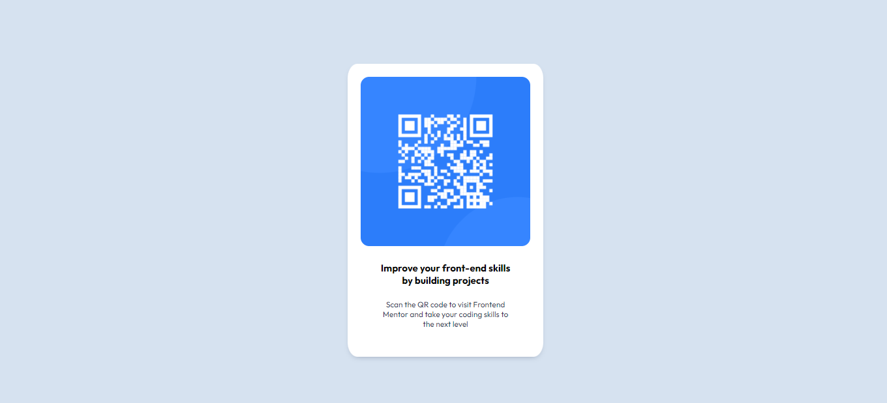

# Frontend Mentor - QR code component solution

This is a solution to the [QR code component challenge on Frontend Mentor](https://www.frontendmentor.io/challenges/qr-code-component-iux_sIO_H). Frontend Mentor challenges help you improve your coding skills by building realistic projects.

### Screenshot

### Links

- Solution URL: [Add solution URL here](https://your-solution-url.com)
- Live Site URL: [Add live site URL here](https://your-live-site-url.com)

## My process

### Built with

- Semantic HTML5 markup
- CSS custom properties

### What I learned
I finally understood how CSS positioning properties works and learnt about box shadow property

### Continued development

I would want to improve more on my CSS skills, looking forward to learning Flexbox and Grid

## Author

- Frontend Mentor - [@timiredmind](https://www.frontendmentor.io/profile/timiredmind)
- Twitter - [@timi_oladokun](https://www.twitter.com/timi_oladokun)

